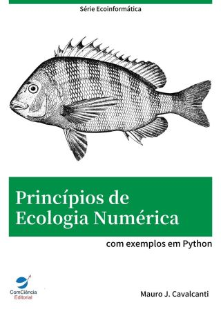

# Princípios de Ecologia Numérica; com exemplos em Python e R

     

Disponível em formato digital (ebook Kindle) na Amazon do Brasil:

* [**versão em Python**](https://amzn.to/3iyguyV)

* [**versão em R**](https://amzn.to/3Ant4Hm)

O objetivo deste livro é apresentar aspectos teóricos e práticos de ecologia numérica, compreendida como toda aplicação de métodos numéricos e procedimentos computacionais na análise de dados ecológicos. Entre os tópicos abordados estão: dados quantitativos e qualitativos, matrizes de dados, coeficientes de similaridade por associação, distância e correlação, testes de associação de matrizes, análise de agrupamentos com métodos hierárquicos aglomerativos e divisivos e métodos não-hierárquicos, além de técnicas de ordenação como análise de componentes principais, análise de correspondências, escalonamento multidimensional e análises canônicas. O texto aborda os métodos através de exemplos práticos, utilizando conjuntos de dados reais, desenvolvidos de forma objetiva com as extraordinárias ferramentas computacionais que são as linguagens Python e R e suas bibliotecas para aplicações em ecologia.

Neste repositório, o(a) leitor(a) encontrará todos os programas em Python e R e os conjuntos de dados apresentados no livro (no diretório `scripts`).
